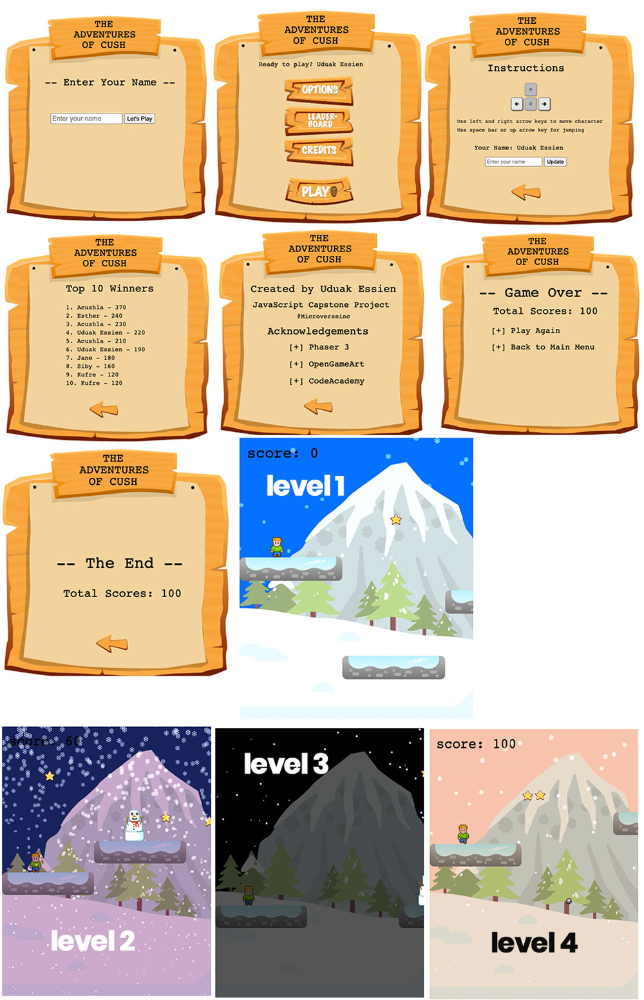

# The Adventures of Cush
## Game Development using Phaser 3, Webpack, and ES6.

> JavaScript Curriculum Final Project @Microverse

Implementation of an Adventure Game built with the [Phaser 3](https://phaser.io/phaser3) framework.

In this project, I utilize the Phaser 3 framework to build an adventure game with four levels comprising of snowman enemy and bomb at level 4 only. The player acquires points by collecting star coins.

I used local storage to persist player scores as he/she transitions to the next level/scene of the game.
I also used the Leaderboard API to post the player's score, displaying the top 10 players on the leaderboard scene.

### How to Play
The player can move the player using left or right arrow keys to move the player to left or right respectively. You can use the spacebar or up arrow key for jumping.

## Built With

- HTML5/CSS
- Phaser 3
- Webpack
- Javascript
- Eslint
- Babel
- Jest for testing
- [Netlify](https://www.netlify.com/) for deployment
- [Leaderboard API service](https://www.notion.so/Leaderboard-API-service-24c0c3c116974ac49488d4eb0267ade3) for high scores

## Live Demo
[Play Game on Live Link](https://cush.netlify.app/)

## Using This Project

1. Make a directory somewhere in your file system where you want to keep your project.
2. `cd` into that directory from the command line.
3. Clone this project with `git clone https://github.com/acushlakoncept/rpg-game.git`.
4. `cd` to rpg-game

## Installing Dependencies

1. From the cloned project's directory, run `yarn install`.

## Running The Project

Once you've installed the project's dependencies, you can run the project using [Webpack Dev Server](https://github.com/webpack/webpack-dev-server).

1. From your project's directory, run `yarn webpack-dev-server`.
2. Open up your browser to `http://localhost:8080`.
3. You should see a web page with the game interface requesting for player name. That's our game!
4. :tada:

Because you are running the project through Webpack Dev Server, any time you make a change to your source code, the browser will automatically refresh with your updated code.

## Testing
Jest, a JavaScript testing framework was used for testing to ensure correctness of any JavaScript codebase.
To run the test use: `yarn jest`

## Building The Project
To host the project on external server like netlify, you will need to run the webpack build command:
`yarn webpack`

### Scenes
Below are the different scenes of the game:
1. Preload Scene
2. Player Scene
3. Intro Scene
4. Option Scene
5. Credit Scene
6. Leader Board Scene
7. Level Scene
8. Level 1 Scene
9. Level 2 Scene
10. Level 3 Scene
11. Level 4 Scene
12. Game Over Scene
13. End Scene

## Future Implementation
- Three Life-line for player

## Author 

**Uduak Essien**

- Github: [@acushlakoncept](https://github.com/acushlakoncept/)
- Twitter: [@acushlakoncept](https://twitter.com/acushlakoncept)
- Linkedin: [acushlakoncept](https://www.linkedin.com/in/acushlakoncept/)

## 🤝 Contributing

Contributions, issues and feature requests are welcome!

Feel free to check the [issues page](https://github.com/acushlakoncept/rpg-game/issues).

## Show your support

Give a ⭐️ if you like this project!

## Acknowledgments

- [Microverse](https://www.microverse.org/)
- [Phaser](https://phaser.io/)
- [OpenGameArt](https://opengameart.org/)
- [Code Academy](https://www.codecademy.com/learn/learn-phaser)